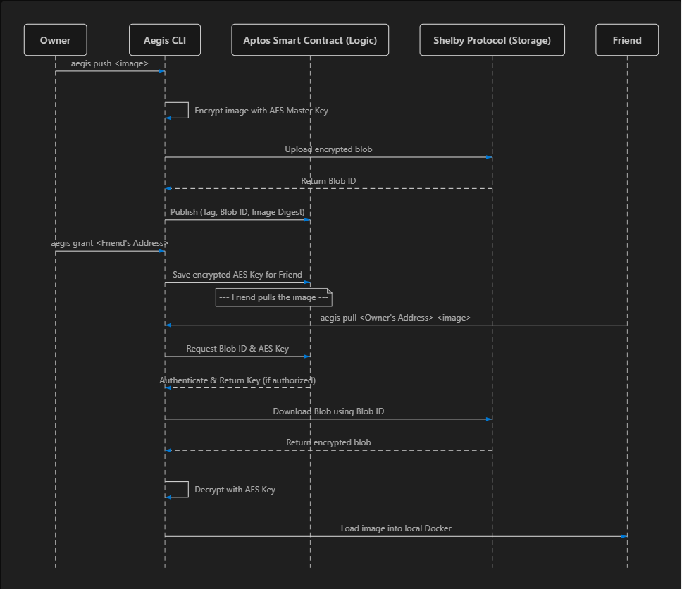
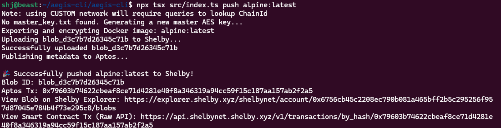
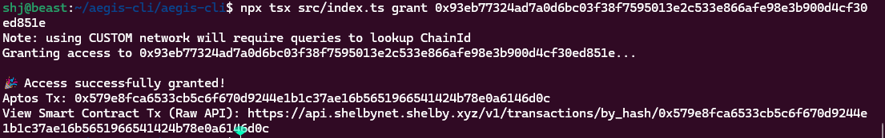
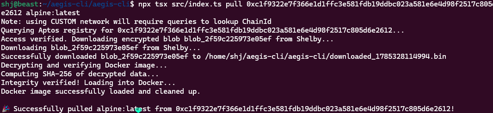

# Aegis - Zero-Trust Decentralized Container Registry

Aegis is a highly secure, zero-trust container registry built on the **Shelby Protocol** (Decentralized Storage) and the **Aptos Blockchain** (Smart Contract Logic). 

It allows you to securely encrypt and publish Docker images to a decentralized network, and mathematically enforce access control using on-chain smart contracts. No central authority can access your images without your cryptographic permission!

## 🏗️ Architecture (Split-Brain)
- **Shelbynet (Storage)**: The Shelby network acts as a decentralized hard drive. It blindly stores encrypted Docker images (blobs) with sub-second retrieval latency.
- **Aptos Smart Contracts (Logic)**: Our custom `registry.move` smart contract acts as the access control layer. It stores the AES master keys securely on-chain and maps them to authorized wallet addresses.



---

## 🚀 Getting Started

### 1. Prerequisites & Dependencies
You will need the following system software installed on your machine:

- **Node.js (v18+)**: 
  - **Ubuntu/Linux (via NVM):** 
    ```bash
    curl -o- https://raw.githubusercontent.com/nvm-sh/nvm/v0.39.7/install.sh | bash
    source ~/.bashrc
    nvm install 18
    ```
  - **Windows/Mac:** [Download Node.js](https://nodejs.org/)
- **Docker**: Ensure the Docker daemon is running locally before using the CLI.
  - **Ubuntu/Linux:** 
    ```bash
    sudo apt-get update && sudo apt-get install -y docker.io
    ```
  - **Windows/Mac:** [Download Docker Desktop](https://www.docker.com/products/docker-desktop/)

### 2. Wallet Setup & Faucets
You need an Aptos wallet address (e.g., Petra Wallet) funded with testnet tokens.
Because this project runs on **Shelbynet**, you will need both APT (for gas) and ShelbyUSD (for storage).
- **Aptos (APT) Faucet (For Smart Contract Gas):** `https://docs.shelby.xyz/apis/faucet/aptos`
- **ShelbyUSD (SUSD) Faucet (For Blob Storage):** `https://docs.shelby.xyz/apis/faucet/shelbyusd`

### 3. Installation
Clone the repository and install the CLI dependencies:
```bash
git clone https://github.com/Doppler2u/aegis-cli.git
cd aegis-cli/aegis-cli
npm install
```
> [!WARNING]
> **WSL Users:** If you get an `esbuild` or `cmd.exe` error during `npm install`, your Ubuntu terminal is accidentally using the Windows version of Node. To fix this, either run the installation in a standard **Windows PowerShell** terminal, or install Linux Node natively in your WSL using the `nvm` commands listed in the Prerequisites above!

### 4. Environment Variables
Copy the example environment file and fill in your details:
```bash
cp .env.example .env
nano .env
```
Inside `.env`, set your `APTOS_PRIVATE_KEY` and `APTOS_ADDRESS` to your funded testnet wallet.

---

## 🛠️ Usage

### Initialize the Repository
Initialize your secure registry on the blockchain. You only need to run this once per wallet address:
```bash
npx tsx src/index.ts init
```

### Push a Docker Image
If you don't have an image to test with, download a tiny test image from Docker Hub first:
```bash
docker pull alpine:latest
```

> [!TIP]
> **Docker Permission Denied?** If you are on Linux or WSL and get a `permission denied ... docker.sock` error, run `sudo chmod 666 /var/run/docker.sock` to quickly grant your terminal access to Docker!

Encrypt your local Docker image and push it to the Shelby network:
```bash
npx tsx src/index.ts push alpine:latest
```
*This command will automatically generate an AES master key, encrypt the Docker image, upload it to Shelby storage, and map the blob ID to your smart contract.*



### Grant Access
Want to share your proprietary image with a friend or colleague? Grant their wallet address access:
```bash
npx tsx src/index.ts grant <FRIENDS_APTOS_ADDRESS>
```
*This securely stores your encrypted AES master key on the Aptos blockchain, allowing only their specific private key to retrieve it.*



### Pull a Docker Image
To download an image, the user must have their private key in their `.env` file and they must have been granted access by the owner:
```bash
npx tsx src/index.ts pull <repo-owner-address> alpine:latest
```
*This command reads the smart contract, retrieves the blob ID, downloads the encrypted file from Shelby, decrypts it locally, verifies the SHA-256 integrity, and instantly loads it into the local Docker daemon.*



---

## 🔍 Verification & Explorers

Because of the split-brain architecture, you use two different tools to verify your data:

**1. Verifying Storage (Shelby Explorer)**
To prove your file is stored on the decentralized network, visit:
`https://explorer.shelby.xyz/shelbynet/` and search for your Aptos Wallet Address.

**2. Verifying Access Control (Aptos API)**
Because official visual explorers dropped support for custom RPCs, you can verify your Smart Contract state (who has access) by querying the raw blockchain API:
`https://api.shelbynet.shelby.xyz/v1/accounts/<YOUR_ADDRESS>/resources`
*(Search the JSON for "encrypted_keys" to see your authorized users!)*
